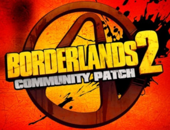
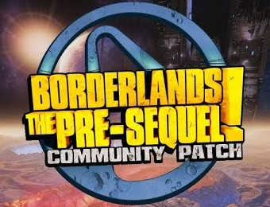

# Hello Vault Hunter!

This page aims to be the first stop for folks interested in running mods for
the Borderlands series (primarily for Borderlands 2 + The Pre-Sequel, at the
moment).

# Running Mods

The easiest way to run Borderlands 2 / Pre-Sequel mods is to install the
Borderlands Community Mod Manager, or BLCMM.

BLCMM will take care of hex-editing your game so that the console is
usable for executing mods, and will manage your mods by combining them all
into a single file which can be run once from the BL2/TPS console.

[Click here to download and install BLCMM](https://www.dropbox.com/sh/rsljh5c55s8e9ah/AABMuarIfYCxJb8GiSY1IF6La?dl=0) *(last updated: [fill in a date or something])*

BLCMM will auto-update to the latest version, if needed, from its splash
screen.

# Getting Mods

There are two primary places to acquire mods for BL2 and TPS: Github and
Nexus Mods.  Github has been the primary place to store mods for some time
now, but more modders have been using Nexus recently.

## Github

Mods for both BL2 and TPS are stored [at the BLCMods Github page](https://github.com/BLCM/BLCMods).
Most users will want to download mods individually, which is unfortunately
not super straightforward.  When you browse to a mod file you want to
download, it will either have a `Raw` button or a `Download` button, in the
upper right hand corner of the file's contents:

Right-click on that button and choose `Save Link As...` to save the file to
your computer, and then use BLCMM to import the mod.

Finding mods on Github is probably its biggest problem, because it's not
easy to browse through the whole repository.  There is a small attempt at
categorizing Github mods on the [ModCabinet wiki](https://github.com/BLCM/ModCabinet/wiki)
but the majority of the Github mods are not found there yet.

## Nexus

Downloading and finding mods on Nexus is more straightforward than on
Github, though you do need an account on Nexus in order to download
mods.

- [Borderlands 2 Mods at Nexus](https://www.nexusmods.com/borderlands2)

- [Borderlands: The Pre-Sequel Mods at Nexus](https://www.nexusmods.com/borderlands2)

# Major Mod Packs

There are a few "major" mod packs which usually serve as a basis for modding.
Many folks will use these as their base patch file and then add more mods to
them as they desire.

## Borderlands 2 Unofficial Community Patch (BL2 UCP)

This patch attempts to fix many known issues and bugs in the game as well as
address dozens of gameplay and balance related issues.  It is available from
[Github](https://github.com/BLCM/BLCMods/tree/master/Borderlands%202%20mods/Community%20Patch%20Team)
or [Nexus](https://www.nexusmods.com/borderlands2/mods/50).

The current version of BL2 UCP is 4.1, and was released in July, 2018.

## Borderlands: The Pre-Sequel Unofficial Community Patch (TPS UCP)

The TPS UCP has very similar aims as the BL2 UCP.  It is available from
[Github](https://github.com/BLCM/BLCMods/tree/master/Pre%20Sequel%20Mods/Community%20Patch)
or [Nexus](https://www.nexusmods.com/borderlandspresequel/mods/8).

The current version of TPS UCP is 2.2, and was released in August, 2018.

## BL2 Reborn

If you want to experience Borderlands 2 in a new way, this modpack is exactly
for you. Currently including 155+ mods and over 650 changes!  Note that BL2 Reborn
already includes UCP - you should not try to use both UCP and Reborn at the same
time.  BL2 Reborn is available on [Nexus](https://www.nexusmods.com/borderlands2/mods/115).

## FFYLands

FFYLands is a huge game overhaul which makes game harder, but more rewarding.  As
with Reborn, do not use UCP at the same time as FFYLands.  It is availble on
[Nexus](https://www.nexusmods.com/borderlands2/mods/57).

# Community / Support

The longest-running place for BL2/TPS modders to hang out, discuss mods, get help with
modding, and share their creations, is the [Shadow's Evil Hideout](https://discord.gg/0YjZxbVBS9b3bXUS)
discord channel.  Stop by and say hello!  We're a friendly bunch.  There is also
a channel for getting help as a user, if you're not able to get mods working properly.

# Writing Mods

BL2/TPS modding is easier than you might think.  If you're interested in modding, the
official [BLCMods Wiki](https://github.com/BLCM/BLCMods/wiki) has a lot of information
which may help you out.  The Shadow's Evil Hideout discord server is also full of
people who'd be happy to help you out.
